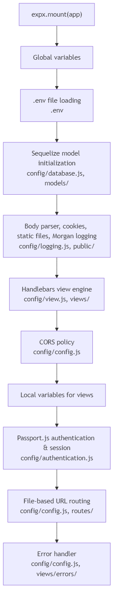

<p align="center">
  
</p>

<p align="center">
  <a href="https://www.npmjs.com/package/express-sweet"></a>
  <a href="LICENSE"></a>
  <a href="package.json"></a>
</p>

One function call. Full stack. Auth, ORM, routing, views — everything snaps together so you can ship fast and stay sharp.

## What is Express Sweet?

Express Sweet is a full-stack toolkit built on top of Express.js. Instead of wiring up a dozen middleware packages by hand, you call one function and get a production-ready stack: Sequelize ORM, Passport.js authentication, Handlebars views with 37 built-in helpers, file-based routing, file uploads, and more.

```js
import express from 'express';
import * as expx from 'express-sweet';

const app = express();
await expx.mount(app);
app.listen(3000);
```

That's it. Four lines of real code and you have a fully configured web application.

## Features

- **One-line setup** — `expx.mount(app)` initializes everything in the right order
- **File-based routing** — Drop a file in `routes/`, get a URL endpoint automatically
- **Sequelize ORM** — Custom `Model` base class with `findById()`, `begin()`, raw queries, and association support
- **Passport.js auth** — Username/password login, session management (memory or Redis), route protection
- **Handlebars views** — Pre-configured template engine with 37 built-in helpers
- **File uploads** — Multer integration with per-route upload resolution
- **CORS** — Toggle with a single config flag
- **Environment variables** — Automatic `.env` loading
- **Dual format** — Ships as both ESM and CommonJS

## Screenshots

| Sign In | Home | People |
|---------|------|--------|
|  |  |  |

| New Person | Edit Profile | Change Avatar |
|------------|-------------|---------------|
|  |  |  |

## Quick Start

### The fast way — use the generator

```bash
npx express-sweet myapp
cd myapp
npm install
npm run setup
npm start
```

One command scaffolds a complete app with auth, database, CRUD, and file uploads — ready to run. See [express-sweet-generator](https://github.com/shumatsumonobu/express-sweet-generator) for options.

### From scratch

#### Install

```bash
npm install express-sweet
```

#### Create config files

Express Sweet uses convention-based configuration. Create a `config/` directory with the files you need:

```
your-app/
  config/
    config.js          # App basics (CORS, body size, routing)
    database.js        # Sequelize connection settings
    authentication.js  # Passport.js auth settings (optional)
    view.js            # Handlebars view engine (optional)
    logging.js         # Morgan HTTP logging (optional)
    upload.js          # Multer file upload (optional)
  routes/
    home.js            # → /home
    api/
      users.js         # → /api/users
  models/
    UserModel.js
  views/
    home.hbs
  app.js
```

You don't need to write config files from scratch. Copy from [examples/](examples/) (ESM and CJS templates included) and just fill in your values.

#### Boot the app

```js
// app.js (ESM)
import express from 'express';
import * as expx from 'express-sweet';

const app = express();
await expx.mount(app);
app.listen(3000, () => console.log('Running on http://localhost:3000'));
```

```js
// app.js (CommonJS)
const express = require('express');
const expx = require('express-sweet');

async function main() {
  const app = express();
  await expx.mount(app);
  app.listen(3000, () => console.log('Running on http://localhost:3000'));
}
main();
```

`mount()` initializes all middleware in a carefully ordered sequence:

<!-- Mermaid source: screenshots/mount-flow.mmd, regenerate with: npm run diagram -->


## Configuration

Six config files control the framework. All are optional — Express Sweet uses sensible defaults when a file is missing.

| File | Purpose | Key Options |
|------|---------|-------------|
| `config.js` | App basics | `cors_enabled`, `max_body_size`, `router_dir`, `default_router`, `hook_handle_error` |
| `database.js` | DB connection | `database`, `username`, `password`, `host`, `dialect`, `pool` |
| `authentication.js` | Auth settings | `enabled`, `session_store`, `authenticate_user`, `allow_unauthenticated` |
| `view.js` | View engine | `views_dir`, `partials_dir`, `default_layout`, `beforeRender` |
| `logging.js` | HTTP logging | `format`, `skip` |
| `upload.js` | File uploads | `enabled`, `resolve_middleware` |

Full option reference → [docs/configuration.md](docs/configuration.md)

## Database & Models

Express Sweet wraps Sequelize with a `Model` base class and a `DatabaseManager` singleton.

### Define a model

```js
// models/UserModel.js
import * as expx from 'express-sweet';

export default class extends expx.database.Model {
  static get table() {
    return 'user';
  }

  static get attributes() {
    return {
      id:    { type: this.DataTypes.INTEGER, primaryKey: true, autoIncrement: true },
      name:  this.DataTypes.STRING,
      email: this.DataTypes.STRING,
    };
  }
}
```

### CRUD

```js
import UserModel from '../models/UserModel.js';

await UserModel.create({ name: 'Alice', email: 'alice@example.com' });
const users = await UserModel.findAll();
const user  = await UserModel.findById(1);
await UserModel.update({ name: 'Bob' }, { where: { id: 1 } });
await UserModel.destroy({ where: { id: 1 } });
```

### Transactions

```js
let transaction;
try {
  transaction = await UserModel.begin();
  await UserModel.create({ name: 'Alice' }, { transaction });
  await transaction.commit();
} catch {
  if (transaction) await transaction.rollback();
}
```

Full reference (associations, raw queries, operators) → [docs/database.md](docs/database.md)

## Authentication

Passport.js integration with session management and automatic route protection.

### Config

```js
// config/authentication.js
export default {
  enabled: true,
  session_store: 'memory',       // or 'redis'
  username: 'email',
  password: 'password',
  success_redirect: '/',
  failure_redirect: '/login',
  authenticate_user: async (username, password, req) => {
    return UserModel.findOne({ where: { email: username, password }, raw: true });
  },
  subscribe_user: async (id) => {
    return UserModel.findOne({ where: { id }, raw: true });
  },
  allow_unauthenticated: ['/login', '/api/login'],
  expiration: 24 * 3600000,
};
```

### Login / Logout

```js
import { Router } from 'express';
import * as expx from 'express-sweet';

const router = Router();

router.post('/api/login', async (req, res, next) => {
  const ok = await expx.Authentication.authenticate(req, res, next);
  res.json({ success: ok });
});

router.get('/logout', (req, res) => {
  expx.Authentication.logout(req);
  res.redirect('/');
});

export default router;
```

Full reference (Redis sessions, redirect helpers, route protection flow) → [docs/authentication.md](docs/authentication.md)

## Routing

Express Sweet uses **file-based routing**. Files in the `routes/` directory are automatically mapped to URL endpoints:

```
routes/
  home.js          → /home
  about.js         → /about
  api/
    users.js       → /api/users
    posts.js       → /api/posts
```

Each route file exports an Express `Router`:

```js
// routes/api/users.js
import { Router } from 'express';
const router = Router();

router.get('/',    (req, res) => res.json([]));
router.get('/:id', (req, res) => res.json({ id: req.params.id }));
router.post('/',   (req, res) => res.json({ created: true }));

export default router;
```

Set `default_router: '/home'` in `config.js` to also mount that route on `/`.

Full reference → [docs/routing.md](docs/routing.md)

## View Engine

Handlebars is pre-configured as the template engine. Express Sweet ships with 37 built-in helpers across 9 categories:

| Category | Helpers |
|----------|---------|
| **Comparison** | `eq`, `eqw`, `neq`, `neqw`, `lt`, `lte`, `gt`, `gte`, `not`, `ifx` |
| **Comparison** (cont.) | `empty`, `notEmpty`, `count`, `and`, `or`, `coalesce`, `includes`, `regexMatch` |
| **Math** | `add`, `sub`, `multiply`, `divide`, `ceil`, `floor`, `abs` |
| **String** | `replace`, `split`, `formatBytes` |
| **Date** | `formatDate` |
| **Number** | `number2locale` |
| **HTML** | `cacheBusting`, `stripTags` |
| **Array** | `findObjectInArray` |
| **Object** | `jsonStringify`, `jsonParse` |
| **Layout** | `block`, `contentFor` |

```handlebars
{{#if (eq role 'admin')}}
  <span class="badge">Admin</span>
{{/if}}

{{formatDate 'YYYY/MM/DD' createdAt}}
{{number2locale price 'en-US'}}
{{add subtotal tax}}
```

Full helper reference → [docs/view-engine.md](docs/view-engine.md)

## File Upload

Multer-based file upload with per-route middleware resolution.

```js
// config/upload.js
export default {
  enabled: true,
  resolve_middleware: (req, multer) => {
    if (req.path === '/api/avatar' && req.method === 'POST') {
      return multer({ storage: multer.memoryStorage() }).single('avatar');
    }
    return null;
  },
};
```

Full reference (disk storage, multiple files, file filtering) → [docs/file-upload.md](docs/file-upload.md)

## Demo

A full-featured demo app is included in [demo/](demo/) — auth, CRUD, file uploads, error pages, all wired up. Both ESM and CommonJS versions. Three commands and you're running.

## Migration from v4

Upgrading from v4? See the migration guide → [docs/migration-v5.md](docs/migration-v5.md)

## Changelog

See [CHANGELOG.md](CHANGELOG.md) for the full release history.

## Author

**shumatsumonobu**

* [github/shumatsumonobu](https://github.com/shumatsumonobu)
* [x/shumatsumonobu](https://x.com/shumatsumonobu)
* [facebook/takuya.motoshima.7](https://www.facebook.com/takuya.motoshima.7)

## License

[MIT](LICENSE)
