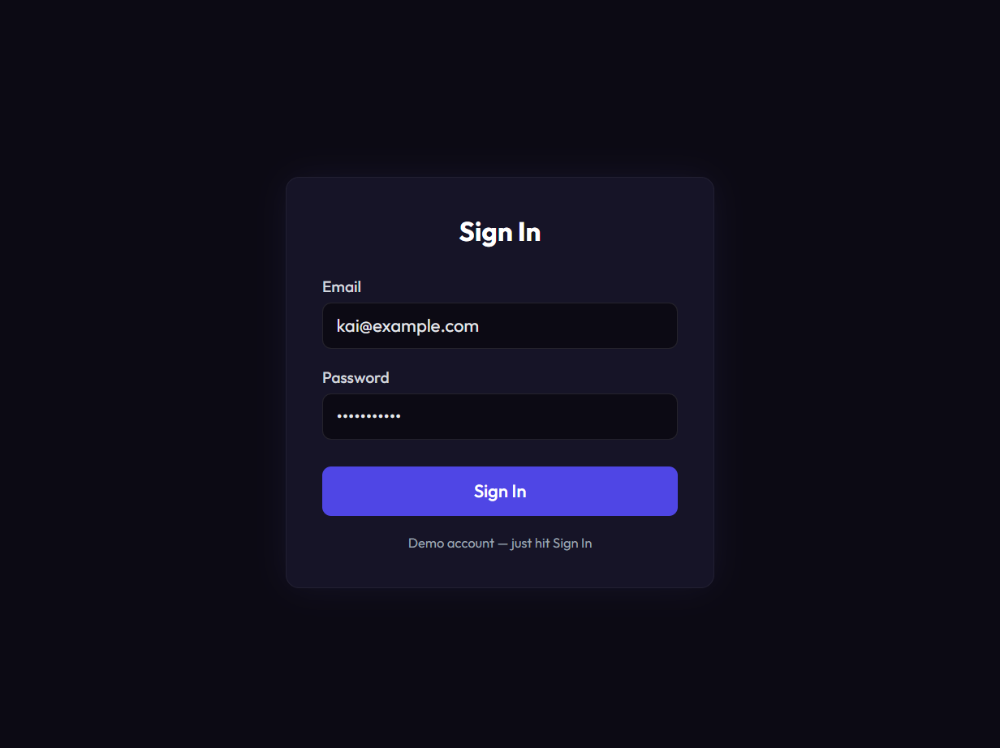
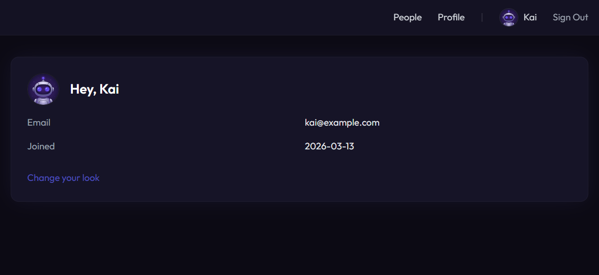
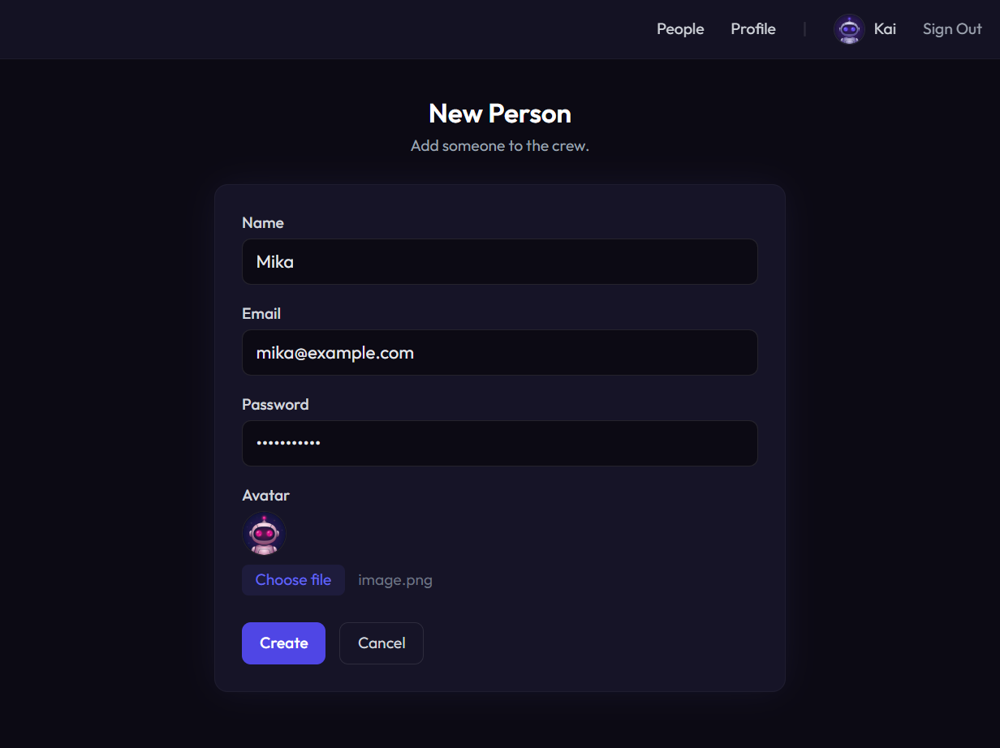
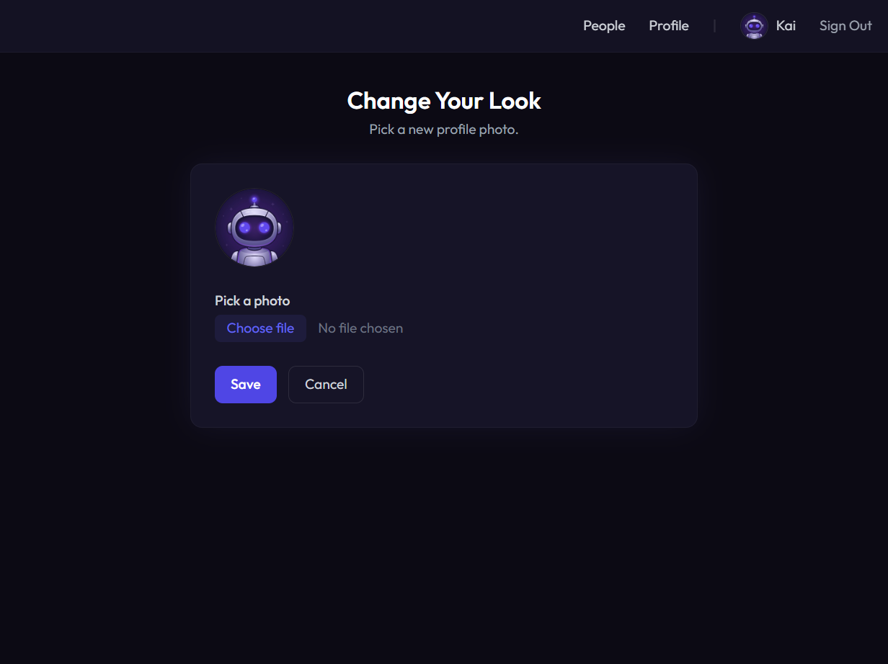

# Express Sweet Demo

A full-featured app built with Express Sweet — auth, database, file uploads, and file-based routing, all wired up and ready to run. Three commands and you're in.

## Quick Start

Both ESM and CommonJS versions are included — pick whichever you prefer.

### ESM

```bash
cd esm
npm install
npm run setup
node app.js
```

### CommonJS

```bash
cd cjs
npm install
npm run setup
node app.js
```

Open http://localhost:3000 and sign in with `kai@example.com` / `password123`.

## Tech Stack

| Layer | Technology |
|-------|------------|
| Framework | [Express Sweet](../) v5 on Express.js |
| Auth | Passport.js (local strategy + session) |
| Database | SQLite via Sequelize |
| Views | Handlebars with 37 built-in helpers |
| File Upload | Multer |
| Styling | Tailwind CSS (CDN) |

## Screenshots

### Sign In


### Home


### People


### New Person


### Edit Profile


### Change Your Look


## What's Inside

| Screen | URL | Feature |
|--------|-----|---------|
| Sign In | `/login` | Passport.js authentication |
| Home | `/` | Session data, Handlebars helpers |
| People | `/users` | Sequelize model, `findAll` |
| New Person | `/users/new` | Form POST, `create` |
| Edit Profile | `/users/:id/edit` | Form PUT, `update` |
| Remove | `/users/:id` (DELETE) | Self-delete protection |
| Change Your Look | `/profile/avatar` | Multer file upload |
| Sign Out | `/logout` | Session destroy |

## File-based Routing

Files in `routes/` are automatically mapped to URL endpoints:

| File | URL |
|------|-----|
| `routes/home.js` | `/home` (also `/` via `default_router`) |
| `routes/login.js` | `/login` |
| `routes/logout.js` | `/logout` |
| `routes/users.js` | `/users`, `/users/new`, `/users/:id/edit`, `/users/:id` |
| `routes/profile/avatar.js` | `/profile/avatar` |

No manual route registration needed — just create a file and it becomes an endpoint.

## Project Structure

```
esm/
├── .env                # Environment variables (PORT, NODE_ENV)
├── app.js              # Entry point
├── setup.js            # Database setup script
├── ddl.sql             # Database schema + seed data
├── package.json
├── config/
│   ├── config.js       # App settings, routing, error pages
│   ├── database.js     # SQLite connection
│   ├── authentication.js  # Passport.js config
│   ├── view.js         # Handlebars settings
│   ├── logging.js      # Morgan format
│   └── upload.js       # Multer config
├── public/
│   └── img/            # Avatar images
├── models/
│   └── UserModel.js    # Sequelize model
├── routes/
│   ├── home.js         # Dashboard (default route)
│   ├── login.js        # Auth login
│   ├── logout.js       # Session destroy
│   ├── users.js        # CRUD (list, create, edit, delete)
│   └── profile/
│       └── avatar.js   # File upload
└── views/
    ├── layout/
    │   └── default.hbs # Shared layout with nav
    ├── home.hbs
    ├── login.hbs
    ├── users.hbs
    ├── users-new.hbs
    ├── users-edit.hbs
    ├── avatar.hbs
    └── errors/
        ├── 404.hbs
        └── 500.hbs
```
